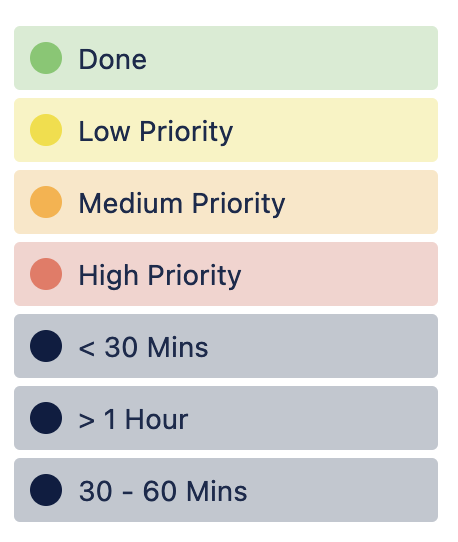
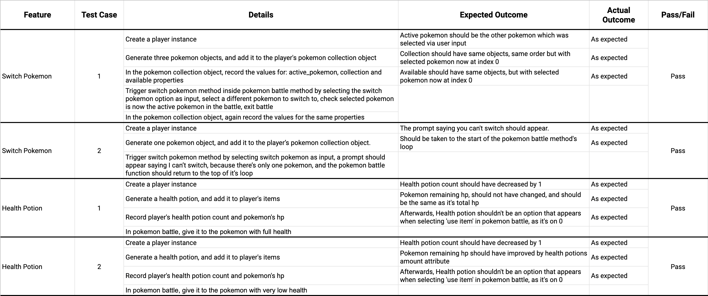

# Terminal Assignment

## Link
[GitHub](https://github.com/jfhaines/terminal-assignment)

## App Features
This app is a Pokemon clone game that can run via the terminal application. It provides a number of features that users can take advantage of during gameplay.

### Generate and Display Map
With this feature, the game generates a 2D map, acting as a grid which contains multiple squares. Each square on the map is either empty or contains an item (PokeBall, Health Potion or Move Potion) which can be picked up, a patch of grass where there’s a chance you might encounter a wild Pokemon or a Pokemon trainer who you can battle. Each of these squares are randomly generated, so each play though will look completely different.  Each Pokemon that appears on the map is also randomly generated, and depending on the game’s set up, you can encounter up to 905 different Pokemon. 

### Move Player
The game allows the player to move their player object around the map in all directions. If you step onto a patch of grass, you might encounter a wild Pokemon. If you try to move onto a square that contains an item, you’ll be asked if you want to pick it up. And if you attempt to move onto a square containing a trainer, you’ll be asked if you want to battle them. 

### Pickup Items
When you encounter an item on the map, you get the chance to pick it up. If you say ‘yes’, the item will be added to your item bag, which allows you to use the item later on during a Pokemon battle. The available items are PokeBalls, Health Potions and Move Potions. 

### Battle Wild Pokemon
When you step through a patch of grass on the map, you’ll occasionally encounter a wild Pokemon. When this occurs, you’ll immediately start a Pokemon battle. In this game mode, you get to switch between the Pokemon in your player’s collection, and choose which one you want to use. You have the option of being displayed the Pokemon in your player’s collection, including key stats. You can also choose to display the items you have available to you. But most of the time, you’ll be attacking the opponent Pokemon with one of your active Pokemon’s moves. 

### Use Move
When attacking an opponent Pokemon in a Pokemon battle, you get to select a ‘move’ to use. Each Pokemon knows a maximum of four moves, each of which deals a certain amount of damage to the opposing Pokemon. Each move can only be used a certain amount of times, so pick wisely. The opponent Pokemon also gets a chance to use a move and attack your Pokemon in response.

### Use Potion
During a Pokemon battle, your Pokemon might get low on health. In this scenario, you might want to use a Health Potion to restore the Pokemon’s health (HP stat). Additionally, each Pokemon move can only be used a set number of times (PP stat), but if it runs out, you can always use a Move Potion, which resets this all the way or partially. 

### Catch Pokemon
During a Pokemon battle with a wild Pokemon, you can choose to use a PokeBall on the wild Pokemon. Here, you get a chance to ‘catch’ the pokemon and add it to your collection. The lower the opponent Pokemon’s health, the more likely you are to catch it.

### Battle Trainers
In addition to battling wild Pokemon, you can battle other Pokemon trainers. These trainer’s, similar to you, can carry multiple Pokemon, but this number will vary across trainers. Here, you’ll get to have individual Pokemon battles against their Pokemon. This battle will continue until one trainer runs out of Pokemon to use. 


## Project management
I developed a project management plan which broke each feature down and identified the individual tasks to be completed to make each feature. This plan was implanted through the use of a Trello board. Because there were so many features in the app, with each feature containing a number of sub-tasks, I decided to create a separate column on the Trello board for each feature, and created ‘cards’ on Trello to represent each sub-task, and then assigned it to the relevant column. To create the app, I had to work on different features simultaneously, but I attempted to arrange the columns (representing the features) in order from left to right based roughly on how early in the development process their sub-tasks should be completed. I also ordered the sub-tasks in their respective columns from top to bottom in their respective order based on how early in the process each one should be completed. Features and sub tasks  that had to be completed before other features and subtasks could be started (such as building classes and assigning attributes) were generally given given shorter deadlines and given higher priority. The cards representing the tasks were each given a due date, and when the task was done, I ticked it as complete, and the due date now appeared as a green label. When a task was finished, I gave it a green ‘Done’ label to make it highly visible. I created labels to help priorities the tasks, with yellow being ‘low priority’, yellow representing ‘medium priority and red representing ‘high priority’. I also created black labels which indicate the estimated duration of each task.



## How to Use
1. To run this program, you’ll need to have Python installed on your computer, in which case please go to this [link](https://www.python.org/downloads/) and follow the instructions.

2. Clone the files from the app’s GitHub repository with the ```git clone git@github.com:jfhaines/terminal-assignment.git``` command in your terminal:

3. From here, use the ```cd src``` command to navigate to the src folder.

4. To run and play the game, use ```./run.sh```. You can specify the difficulty settings with command line args/flags (```—hard``` or ```-h``` for hard, ```—easy``` or ```-e``` for easy and ```—normal``` or ```-n``` for normal). This will also download any dependencies in the requirements.txt file automatically. 

5. To specify the number of Pokemon available in the game, use ```./update.sh [arg]```, with arg being an integer from 1 to 905. Specifying ```./update.sh 300``` for example would download the first 300 Pokemon in the PokeDex into the game. If the API responsible for downloading the Pokemon data breaks, you can manually reset the Pokemon info using ./reset.sh, which will reset the available Pokemon in the game to the first 151 Pokemon in the Pokedex using a backup file stored locally.

## Testing
A number of tests were carried out to ensure the features being tested worked as intended. The process of these tests and their results can be seen below.


## Style Guide
- Pep 8
